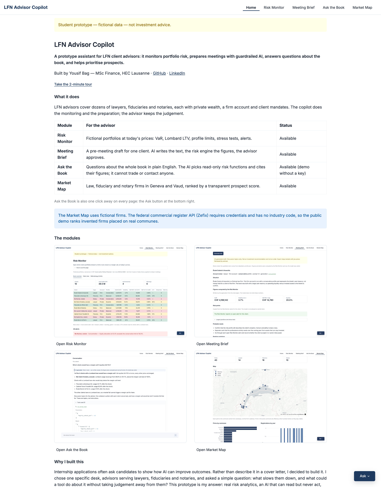
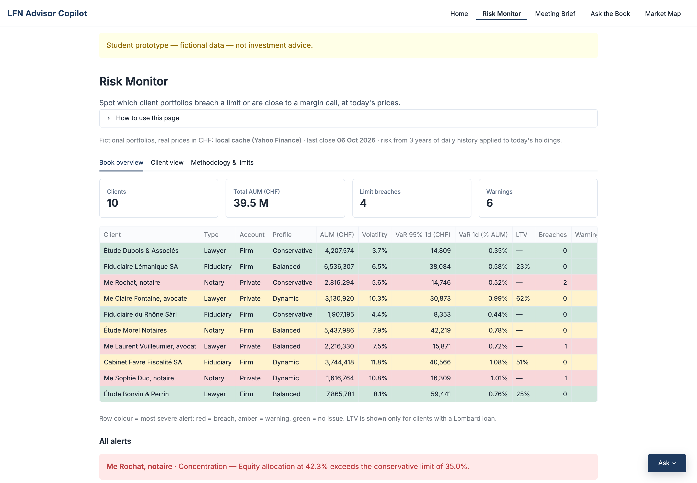
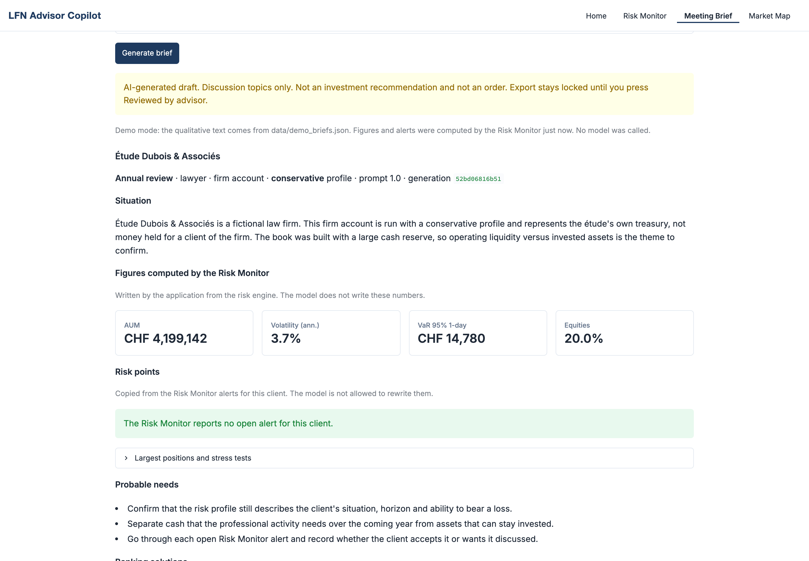
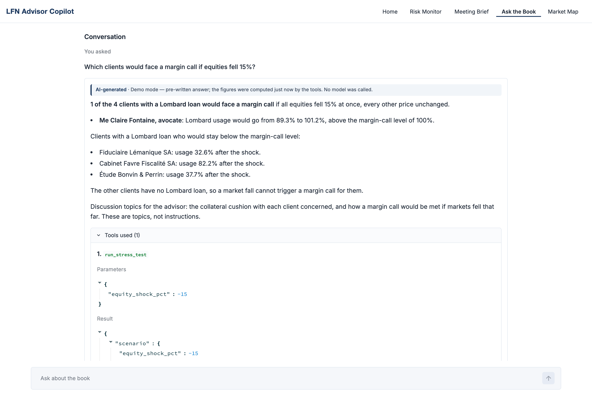
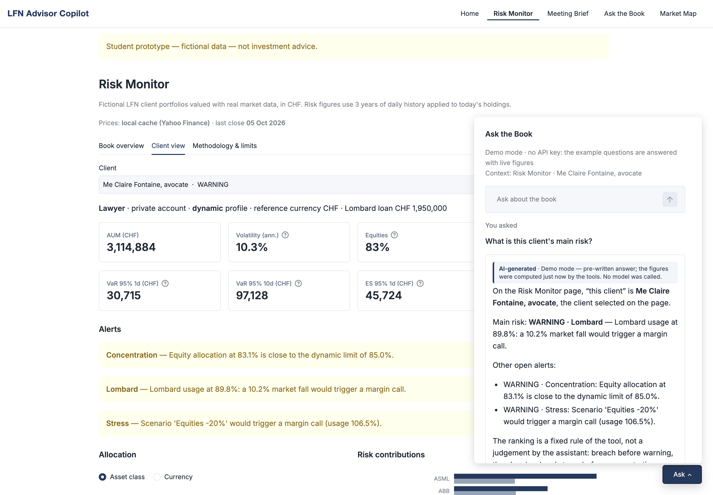
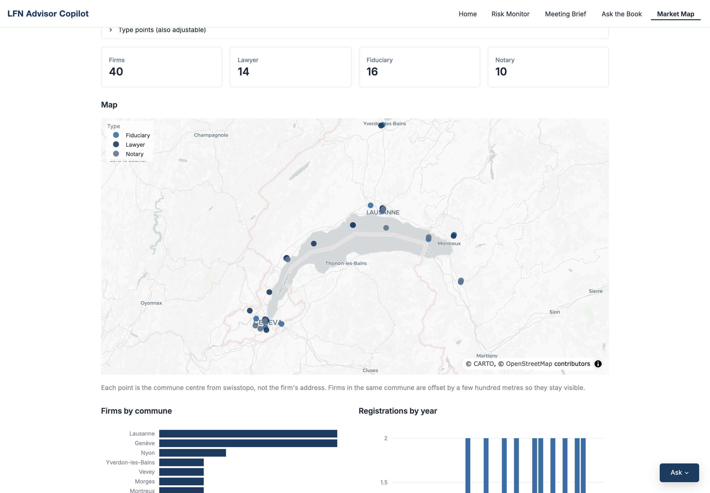

# LFN Advisor Copilot

*Student prototype — fictional data — not investment advice.*

**A prototype assistant for LFN client advisors: it monitors portfolio risk, prepares meetings with guardrailed AI,
answers questions about the book, and helps prioritise prospects.**

**Live demo:** [lfn-advisor-copilot.streamlit.app](https://lfn-advisor-copilot.streamlit.app) — no login, no API key needed.

Built by Yousif Bag — MSc Finance, HEC Lausanne · [GitHub](https://github.com/yxseef) ·
[LinkedIn](https://www.linkedin.com/in/yousif-bag-8002303b2/)

## In two minutes

In Swiss private banking, **LFN** teams serve **lawyers, fiduciaries and notaries**: their own wealth and firm
accounts, and the needs of the clients they represent (estates, property deals, escrow accounts). An advisor covers
dozens of such relationships and must spot risk early and prepare every meeting with limited time.

This independent student project shows four tools for that job. Every client and firm is invented, and the project
has no link to any bank.

| Module | What the advisor gets |
|---|---|
| **Risk Monitor** | Ten fictional portfolios valued every day with real market prices. Risk figures, profile limits and automatic alerts, ranked by severity. |
| **Meeting Brief (AI)** | A one-page pre-meeting draft for one client. The AI writes the narrative, the risk engine writes the figures, and the advisor must approve the draft before export. |
| **Ask the Book (AI)** | Questions about the whole book in plain English, from a full page or the Ask button on every page. The AI picks read-only risk functions and cites the figures they return. It cannot trade, change data or contact anyone. |
| **LFN Market Map** | Law, fiduciary and notary firms in Geneva and Vaud on a map, with a prospect score whose weights the advisor sets. The public demo uses fictional firms (see [Limits](#limits)). |

### Home

On a first visit, Home offers a two-minute tour that follows one fictional client, Me Claire Fontaine, from her
Lombard warning in the Risk Monitor to her meeting brief and a margin-call question in Ask the Book. Every page also
opens with one line on what it is for and a collapsed "How to use this page".



### Risk Monitor



### Meeting Brief



### Ask the Book



The same assistant opens as a compact window from the Ask button, here on a client's Risk Monitor page:



### LFN Market Map



## Responsible AI

Two modules can call a language model, the Meeting Brief and Ask the Book. The guardrails are on by default:

1. **Only fictional data goes in.** The prompt contains one fictional client from the Risk Monitor. A free-text note
   with a name, an email, an IBAN or a Swiss AVS number is blocked before any call.
2. **Figures come from the risk engine.** AUM, volatility, VaR and alerts are written by the application. Any other
   number the model writes is marked "(to verify)".
3. **Discussion topics, not orders.** Banking solutions come from a closed list of generic product families. A sentence
   that reads like a trading instruction is rewritten as a discussion topic.
4. **A human signs off.** The draft carries an "AI-generated draft" banner, and PDF or Markdown export stays locked
   until the advisor clicks "Reviewed by advisor".
5. **No key, no cost.** Without an API key the page uses pre-written text and makes no call. With a key, live calls are
   capped at five per session, and the session journal records the time, prompt version, client and review status,
   never the brief, the note or the key.
6. **Ask the Book only reads.** Its five tools read the Risk Monitor. No tool writes, trades or sends anything, so a
   request to sell or to contact a client is refused with an explanation. The same input filter applies, every answer
   carries an "AI-generated" banner, and figures that no tool returned are marked "(to verify)".

## How this was built

I designed the project, wrote the specifications and validated the formulas. The code was written with an AI
assistant (Claude in Cursor), under my control.

---

## Details for technical readers

### Architecture

```
app.py               entrypoint: top navigation, shared style, Home page
assets/              text wordmark shown in the navigation bar
app_pages/           Streamlit pages (UI only)
  1_Risk_Monitor.py
  2_Meeting_Brief.py
  3_Market_Map.py
  4_Ask_the_Book.py
  ask_ui.py          Ask button and chat window shared by every page (not a page)
  guide.py           welcome window, guided tour and page help (not a page)
core/                pure, typed functions, no UI
  portfolios.py      fictional clients and portfolios (fixed seed)
  risk.py            prices, risk metrics, limits, stress tests, alerts
  llm.py             LLM wrapper, guardrails, demo mode, PDF/Markdown export
  agent.py           Ask the Book: read-only tools, input screen, tool-use loop, demo answers
  market_map.py      firm cleaning, keyword classification, geocoding, prospect score
data/                price fallback, demo briefs, firm file, commune geocode cache
docs/screenshots/    images used here and on the Home page
tests/               pytest, no network
```

The pages folder is called `app_pages/`, not `pages/`. With a `pages/` folder, Streamlit opens a deep link such as
`/Market_Map` in its older folder mode and ignores the `st.navigation` menu.

### Risk methodology

- **Data.** Three years of daily adjusted closes from Yahoo Finance, converted to CHF with daily EUR/CHF and USD/CHF.
  Cached for one hour, with `data/prices_fallback.csv` if the download fails.
- **Volatility.** Standard deviation of daily portfolio returns × √252.
- **Historical VaR 95 %.** The loss not exceeded on 95 % of past days, applied to today's holdings. 10-day VaR = 1-day
  VaR × √10.
- **Expected Shortfall 95 %.** The average loss on the worst 5 % of days.
- **Risk contributions.** Euler decomposition, RCᵢ = wᵢ (Σw)ᵢ / σₚ. Contributions add up to total volatility.
- **Lombard loan.** Lending value = Σ market value × advance rate; usage = loan / lending value. Warning from 80 %,
  margin call above 100 %.
- **Stress tests.** Instant shocks: equities −20 %, EUR/CHF −10 % on EUR assets, +200 bp on bond ETFs
  (loss ≈ duration × 2 %).
- **Alerts.** Each risk profile (conservative, balanced, dynamic) has limits on equities, single equity, gold,
  foreign currency and volatility. Breach above a limit, warning from 90 % of it.

### Meeting Brief pipeline

One Anthropic call (`claude-sonnet-5-5` by default) through `core/llm.py`. The answer must be JSON that matches a
pydantic schema. Invalid JSON, a schema failure or an API error falls back to the pre-written brief and the page says
so. Pre-written text lives in `data/demo_briefs.json` and contains no digits, so figures are always today's.

### Ask the Book agent

The model chooses functions; the application runs them. `core/agent.py` handles one question in four steps:

1. **Screen.** Fictional client names from the book are replaced by their id. The question is then refused before
   any call if it contains an email, an IBAN, an AVS number or another person's name, tries to override the
   instructions ("ignore your instructions"), asks for an action (sell, buy, transfer, send, contact) or asks for a
   buy or sell recommendation. The refusal explains why.
2. **Call tools.** With a key, the question, the open page and the selected client go to Anthropic with the tool
   list. The model answers with tool calls, the application runs them on the Risk Monitor book and sends the results
   back, at most 6 model calls per question.
3. **Check the answer.** Every number in the text must appear in a tool's parameters or results, otherwise it is
   marked "(to verify)". A sentence that reads like a trading instruction is rewritten as a discussion topic.
4. **Log.** The session journal stores the time, the screened question (ids instead of names, withheld if it held
   personal data), the tools called, the mode (demo or live), the status and the prompt version. Not the answer.

| Tool | What it returns |
|---|---|
| `list_clients` | Clients with type, account, profile, AUM, alert status and whether they have a Lombard loan, with optional filters |
| `list_alerts` | Open alerts, filtered by severity, profile, client or category |
| `get_client_risk` | One client's risk figures, profile limits, alerts and main risk |
| `run_stress_test` | Any equity, EUR, USD or rate shock (bounded), P&L per client and who would face a margin call |
| `get_lombard_status` | Loan, lending value, usage, free margin and the uniform fall that would trigger a margin call |

Without a key, five example questions run in demo mode: the wording is pre-written, but the tools are called when
the answer is shown, so the figures are today's. Two of the examples are refusals. A free question in demo mode gets
a short note instead of an answer. With a key, live questions are capped at 10 per session; past the cap, the demo
answer is used when one exists.

The Ask button is a Streamlit popover fixed at the bottom right by CSS. It stays open across reruns and fits a
390-pixel phone screen. The window shows the last answer with its tools collapsed; the full page keeps the
conversation, the journal and the method.

### Market Map score

Score = 100 × weighted average of four criteria, each between 0 and 1. The weights are sliders on the page.

| Criterion | Points |
|---|---|
| Legal form | SA 1 · Sàrl 0.8 · SNC 0.5 · sole proprietorship or other 0.3 |
| Seniority | years since registration ÷ 30, capped at 1 |
| Profession | fiduciary 1 · notary 0.85 · lawyer 0.7 (also adjustable) |
| Local density | firms in the same commune ÷ firms in the busiest commune |

The score is a calling order for an advisor. It does not measure wealth, credit quality or the firm's clients, and
status (active, in liquidation) is shown but not scored.

### Limits

- **Fictional data everywhere.** Clients and portfolios are generated. Market prices are real but serve only as
  illustration.
- **Market Map uses an invented example.** The Zefix PublicREST API answers `401 Unauthorized` without credentials
  from the Federal Registry of Commerce. A search also needs a name of at least three characters, and the records
  carry no NOGA industry code. So the demo ranks invented firms, all named "Exemple…", placed on real communes.
  Filling `data/lfn_firms.csv` with a register extract replaces them.
- **Coverage and classification.** Sole practitioners who are not in the commercial register would be missing.
  Profession is classified from keywords (avocat, notaire, fiduciaire, Treuhand, révision), so a firm can be missed
  or mislabelled. "Étude" alone is ignored because it can mean a law office or a notary office.
- **Map points are commune centres** from swisstopo (geo.admin.ch), slightly offset, never street addresses.
- **Risk model.** Historical VaR assumes the next days look like the last three years. Stress shocks are
  instantaneous and applied one at a time.
- **AI checks are lexical.** The number check can accept a real figure used in the wrong sentence. The model can be
  wrong in a sentence with no figure. Review is a gate, not a guarantee.
- **Ask the Book filters are patterns.** They can miss an unusual phrasing of a request to trade, and they can refuse
  a harmless question that looks like a name or an order. The "(to verify)" check confirms that a number came from a
  tool, not that it was used for the right concept. Demo mode answers only the examples. The journal lasts for the
  browser session, and there is no login.
- **The floating window depends on Streamlit internals.** Its size and position use CSS on a Streamlit test id
  (`stPopoverBody`). A Streamlit upgrade can break the layout, which is why `requirements.txt` pins Streamlit to the
  tested 1.x line (1.65 or later, below 2). The full Ask the Book page does not depend on it.

### Run locally

```bash
python -m venv .venv && source .venv/bin/activate
pip install -r requirements.txt
streamlit run app.py
pytest
```

Python 3.11 or later. The app runs without any key. For a live model, copy `.env.example` to `.env` (gitignored) and
set `ANTHROPIC_API_KEY`, or set it in Streamlit secrets. `ANTHROPIC_MODEL` is optional.

Refresh the price fallback with `python -m scripts.update_price_fallback`.

### Tech stack

Python · Streamlit · pandas · NumPy · Plotly · yfinance · Anthropic API with tool use (optional) · pydantic · fpdf2 ·
swisstopo geo.admin.ch · pytest · Streamlit Community Cloud.
